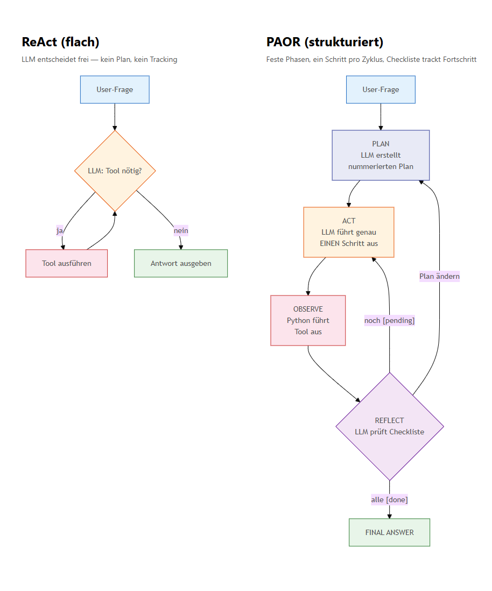

# Notizen — Agentic AI

Zoom: <https://app.zoom.us/wc/2963367976/join?ref_from=launch&fromPWA=1>

## Agentic AI Vorlesungen angucken

- Basics von renommierten Unis
- Literatur zusammentragen

---

## 26.02.2026 Meeting

- Agenten in Blick auf Systeme
- Mehrere Agenten die kommunizieren
- Jedes Teilsystem hat einen Agenten
- LangGraph, LangChain, CrewAI mal einarbeiten !!!
- Explainable AI für autonome Schifffahrt Kontakt
- MetaGPT zentraler Teil
- MCP
- Agentic Coding
- Anwendung für Labor, Beispiele sammeln. Interagieren von Agenten beobachten. Labor mit LangChain z.B.

---

## 17.03.2026 Meeting — Fortschrittsupdate

### Das Ziel

Wie bringen wir Studierenden "Agentic AI" bei, ohne dass es wie schwarze Magie wirkt? Studierende sollen verstehen was ein Agent *ist* — nicht nur wie man einen aufruft.

### Der Ansatz: A/B-Test

Dasselbe Problem (ReAct-Agent mit Websuche, Rechner, Dateilesen) mit zwei Ansätzen gebaut:

- **(a) LangChain/LangGraph** — Framework, wenig eigener Code, viel Abstraktion
- **(b) Eigenes Programmieren** mit rohem Ollama SDK — mehr Code, volle Transparenz

### Die wichtigste Erkenntnis

**Ein Agent ist im Kern nur ~50 Zeilen Python + ein LLM als Textfunktion.** Frameworks wie LangChain verstecken genau das was man verstehen muss.

**Vorschlag für das Labor:** Studierende bauen erst den rohen Loop (eigener Code), um das Prinzip zu verstehen. Dann migrieren sie auf LangGraph, um zu sehen wie man das in der Industrie skaliert.

### Stand

5 lauffähige Prototypen, Benchmark ReAct vs PAOR durchgeführt, 31 Quellen Literatur gesammelt und 7 Kernquellen für die Vorlesung ausgewählt.

---

---

<details><summary><strong>Was wurde gebaut</strong> (5 Sub-Projekte)</summary>

| # | Projekt | Was | Framework | Modell |
|---|---------|-----|-----------|--------|
| 1 | `langchain_simple` | Streaming mit/ohne Thinking-Modus | LangChain | qwen3.5:4b |
| 2 | `langchain_react` | ReAct-Agent mit `create_react_agent`, 3 Tools, REPL | LangGraph | qwen3.5:0.8b |
| 3 | `langgraph_basics` | Hand-gebauter ReAct mit StateGraph + Multi-Agent Supervisor | LangGraph (Jupyter) | qwen3.5:0.8b |
| 4 | `ollama_react` | ReAct-Agent ohne LangChain, manuelles Tool-Calling | Ollama SDK | qwen3.5:4b |
| 5 | `ollama_react_planning` | PAOR-Agent: Plan→Act→Observe→Reflect, transiente Prompts | Ollama SDK | qwen3.5:4b |

**LangChain-Ökosystem — was ist was?**

| Komponente | Wofür? |
|---|---|
| **LangChain** | Mit LLMs reden — Prompts bauen, Tools definieren, Antworten parsen |
| **LangGraph** | Agenten bauen — den Loop (denken → Tool → beobachten → weiter) zusammenstecken |
| **LangSmith** | Zuschauen was der Agent tut — jeden Schritt, jeden Tool-Call, jeden Token im Browser nachverfolgen |

LangSmith-Trace für unser Projekt live unter: [smith.langchain.com](https://smith.langchain.com) → Projekt `langX_rev02`

</details>

<details><summary><strong>Was kann der ReAct-Agent?</strong></summary>

Alle ReAct-Agenten (Projekt 2, 3, 4) lösen dasselbe Problem: ein LLM das selbstständig entscheidet welches Tool es braucht, es aufruft, das Ergebnis liest, und weitermacht bis es eine Antwort hat. Die drei Tools:

| Tool | Was es tut | Beispiel |
|------|-----------|----------|
| `web_search` | DuckDuckGo-Suche | "Young's modulus of titanium" → 120 GPa |
| `calculator` | Sichere Mathe-Auswertung (numexpr) | `(0.3 * 0.5**3) / 12` → 0.003125 |
| `read_file` | Lokale Textdatei lesen | `sample.txt` → Formeln für Flächenträgheitsmomente |

Demo-Queries aus der Ingenieur-Domäne (Flächenträgheitsmomente):
- "Lies sample.txt und sag mir welche Formeln drin stehen"
- "Berechne das Flächenträgheitsmoment eines Rechtecks 0.2 m × 0.4 m"
- "Suche im Web nach dem E-Modul von Baustahl S235"
- Komplexe Aufgabe: Formeln lesen, zwei Querschnitte berechnen, vergleichen, E-Modul suchen, EI berechnen

Der Agent kombiniert dabei mehrere Tools in einer Kette — z.B. erst `read_file` für die Formel, dann `calculator` für die Rechnung, dann `web_search` für den E-Modul.

</details>

<details><summary><strong>LangChain vs eigenes Programmieren</strong> — Vergleich</summary>

Verglichen werden zwei Projekte die **exakt denselben ReAct-Agenten** mit denselben 3 Tools bauen:
- **`langchain_react/`** — mit LangChain/LangGraph Framework (Projekt 2)
- **`ollama_react/`** — mit rohem Ollama Python SDK, ohne Framework (Projekt 4)

| Aspekt | LangChain/LangGraph | Eigener Code (Ollama SDK) |
|--------|--------------------:|:--------------------------|
| **Tool-Definition** | `@tool` Decorator generiert JSON-Schema aus Funktionssignatur (~7 Zeilen/Tool) | JSON-Schemas von Hand schreiben (~50 Zeilen für 3 Tools), muss mit Signatur synchron bleiben |
| **Tool-Dispatch** | `ToolNode` ruft automatisch die richtige Funktion auf, fängt Fehler ab | Dictionary-Lookup + `func(**args)` + try/except (~13 Zeilen) |
| **Agent-Loop** | `create_react_agent()` baut den gesamten ReAct-Loop (~4 Zeilen) | while-Schleife mit Abbruchbedingungen selbst schreiben (~57 Zeilen) |
| **State** | `TypedDict` + `add_messages` Reducer verwaltet History automatisch | Einfache Python-Liste, `messages.append()` von Hand |
| **Streaming** | `.stream()` liefert strukturierte Chunks pro Node | Chunks manuell iterieren, Thinking/Content trennen (~47 Zeilen) |
| **Fehlerbehandlung** | Eingebaut, 0 Zeilen eigener Code | try/except selbst schreiben (~8 Zeilen) |
| **Thinking-Modus** | Kaputt bei Multi-Turn (Bug) | Funktioniert, selektiv pro Phase ein/ausschaltbar |
| **Erweiterbarkeit** | Framework-API lernen, Graphstruktur anpassen | Einfach eine Funktion hinzufügen (z.B. PAOR-Phasen) |
| **Gesamt** | **~10 Zeilen** | **~150+ Zeilen** |

**Vorteile LangChain:** Wenig Code, Production-Features (Checkpointing, Tracing, LangSmith).

**Vorteile eigener Code:**
- Thinking-Modus funktioniert (in LangChain kaputt!)
- Volle Kontrolle über jeden Schritt (Retry, Approval-Gates, Custom-Logging)
- PAOR lässt sich einfach draufbauen
- Man sieht das Drahtformat: was das LLM genau empfängt und zurückgibt
- Didaktisch: der "Agent" ist nur ~50 Zeilen Python + LLM als Textfunktion
- Kein Framework-Lock-in, keine versteckten Bugs

**Fazit:** Für Lehre → eigenes Programmieren. Für Produktion → LangGraph sinnvoll. Didaktischer Ansatz: erst roh bauen, dann LangGraph zeigen was es abstrahiert. (Ausführlicher Vergleich in `ollama_react_planning/README.md`)

</details>

<details><summary><strong>Benchmark: ReAct vs PAOR</strong></summary>

- Gleiche komplexe Ingenieur-Aufgabe (Trägheitsmomente, Websuche, Vergleich, EI)
- **ReAct: bestanden** — 10 Schritte, 9 Tool-Calls, korrektes Ergebnis
- **PAOR: durchgefallen** — 3 Zyklen, 2 Tool-Calls, kein Endergebnis
- Ursache: 4B-Modell verbraucht zu viele Tokens für PAOR-Overhead (Planung, Reflexion)
- Details in `benchmark_report.md`

</details>

<details><summary><strong>Hardware-Bedarf</strong> (begründet durch Benchmark)</summary>

- qwen3.5:4b qualitativ gut aber **langsam** auf lokaler Hardware
- Der PAOR-Benchmark zeigt konkret: **4B-Modelle schaffen den Overhead fortgeschrittener Architekturen nicht.** Um Planungs-Agenten (PAOR) im Labor zu demonstrieren, brauchen wir zwingend:
  - **NVIDIA DGX Spark Zugang** für schnellere lokale Inferenz mit 8B+ Modellen, oder
  - **API-Budget** (Anthropic/OpenAI) — funktioniert zuverlässig, kostet aber Geld
- Thinking-Modus in LangChain kaputt bei Multi-Turn → rohes `ollama.chat()` nötig

</details>

<details><summary><strong>Literatur</strong></summary>

- 31 Quellen gesammelt → `Agentic_AI_Literatur_Feb2026.md`
- 7 Kernquellen für Vorlesung ausgewählt → `Quellen_7_Agentic_AI.md`

</details>

<details><summary><strong>LLM Council — Multi-Agenten-Debatte</strong></summary>

Idee: Mehrere LLM-Agenten mit unterschiedlichen Rollen diskutieren eine Frage und kommen gemeinsam zu einer besseren Antwort als ein einzelner Agent.

**Unser Prototyp** (`langgraph_basics/council.ipynb`): Drei Agenten (Advocate, Critic, Pragmatist) debattieren, ein Moderator entscheidet dynamisch wer als nächstes spricht. Gebaut mit LangGraph `StateGraph` + `Command`-Routing. Beispielfrage: *"Does Scrum actually make teams more productive?"*

**Karpathys LLM Council** (Nov 2025): Andrej Karpathy hat ein ähnliches Konzept als Open-Source "Weekend Hack" veröffentlicht ([github.com/karpathy/llm-council](https://github.com/karpathy/llm-council)). Unterschied: er nutzt *verschiedene echte Modelle* (GPT-5.1, Gemini 3, Claude 4.5, Grok-4) die in drei Phasen arbeiten: Polling → Peer Review → Synthese. VentureBeat nennt es "the missing middleware layer for enterprise AI orchestration."

**Warum relevant für uns:** Council-Debatten sind ein guter Einstieg in Multi-Agent-Interaktion für die Vorlesung — Studierende sehen wie Agenten aufeinander reagieren, nicht nur auf Tools.

</details>

<details><summary><strong>Tool-Anbindung: Function Calling vs MCP</strong></summary>

Unsere Tools (calculator, web_search, read_file) nutzen **normales Function Calling** — Python-Funktionen mit JSON-Schemas, direkt im Code. Das ist *nicht* MCP.

| | Function Calling (unser Ansatz) | MCP (Industriestandard 2026) |
|---|---|---|
| **Was** | Tools als Python-Funktionen im Agenten-Code | Tools als eigene Server, Agent verbindet sich per JSON-RPC |
| **Schema** | Von Hand oder per `@tool`-Decorator | Server exponiert Capabilities automatisch |
| **Kopplung** | Agent und Tools im selben Prozess | Entkoppelt — Tools können in anderen Sprachen/Servern laufen |
| **Austauschbar** | Nein, fest eingebaut | Ja, standardisiertes Protokoll |

**Brauchen wir MCP?** Diskussionspunkt. Function Calling reicht für unseren Anwendungsfall vollkommen aus — drei lokale Tools im selben Python-Prozess, `func(**args)` fertig. MCP würde daraus einen Subprocess + JSON-RPC machen, ca. 15 Zeilen mehr Code, aber funktional identisch. MCP löst ein Problem das wir (noch) nicht haben: viele Tools von verschiedenen Quellen dynamisch anbinden. Das ist relevant für Claude Code, Cursor etc. die hunderte externe Tools (GitHub, Slack, Datenbanken) integrieren müssen — aber nicht für drei selbstgeschriebene Python-Funktionen.

**Für die Vorlesung:** Function Calling als Kern verstehen reicht. MCP kann man erwähnen als "so sieht der Industriestandard aus, der das skaliert" — aber umbauen müssen wir dafür nicht.

</details>

<details><summary><strong>Einordnung: ReAct vs PAOR — was nutzt die Praxis?</strong> (Stand 2026)</summary>

**ReAct ist der Standard.** Claude Code, Cursor, Devin, ChatGPT — alle nutzen im Kern einen ReAct-Loop. PAOR als Begriff existiert in der Praxis kaum.

**Die Idee lebt aber weiter — als Hybrid.** "Plan-and-Act" (ICML 2025) trennt Planner und Executor in zwei Modelle: ein starkes plant, ein günstigeres führt aus (bis 90% Kosteneinsparung). Produktion 2026 = grob planen, dann ReAct-mäßig mit Freiheit abzuweichen.

**Unser Benchmark bestätigt die Forschung:** PAOR-Overhead lohnt sich erst bei großen Modellen. Mit 4B war der Overhead zu viel — das ist kein Code-Fehler, das ist ein bekanntes Problem.

</details>

---

### Offene Punkte

- [ ] DGX Spark Zugang oder API-Budget klären
- [ ] Größere Modelle testen (8B+) für PAOR
- [ ] Council-Debate Notebook fertigstellen
- [ ] Labor-Anwendung mit Multi-Agent-Interaktion
- [ ] **MCP (Model Context Protocol) einbinden** — MCP ist der 2026er Industriestandard (Anthropic → Linux Foundation, 97M+ Downloads, adoptiert von OpenAI, Google, Microsoft). Es standardisiert genau das was wir händisch gebaut haben: Tool-Anbindung (Datei lesen, Rechner, Websuche). Labor-Idee: Studierende bauen erst Tools von Hand, binden dann Standard-MCP-Server an → Labor auf neuestem Industriestandard
- [ ] A2A (Agent-to-Agent) Protokoll ausprobieren
interdizipliäre kommunikation arzt krankenschwester, gemeinsame sprache einigen, agenten austausch

---

### Ergebnisse aus dem Meeting

**1. Labor Phase 1 — ReAct Agent von Hand + LangChain**
- Studierende coden erst den ReAct-Loop von Hand (Ollama SDK), dann bauen sie dasselbe mit LangChain nach
- Tool-Anbindung: einfaches Function Calling reicht, kein MCP nötig
- Zur Frage "haben große LLMs die Konnektoren eingebaut?": **MCP ist NICHT im Modell eingebaut.** MCP ist ein Protokoll das der *Client* implementiert (Claude Code, Cursor etc.), nicht das LLM. Die LLMs können nur natives Function Calling — sie geben strukturiertes JSON zurück ("ich will Tool X mit Argument Y aufrufen"). Das unterstützen alle großen Modelle nativ: GPT-4o, Claude, Gemini, Llama, Qwen. Unser Ansatz (Function Calling von Hand) bildet genau das ab.

**2. Labor Phase 2 — Multi-Agent Diskussion mit LangGraph**
- Council-Debatte bauen (Prototyp existiert: `langgraph_basics/council.ipynb`)
- Brainstorm A2A: interdisziplinäre Kommunikation als Anwendungsfall
- Beispiel: Pfleger ↔ Arzt Missverständnis — Agenten mit verschiedenen Fachsprachen müssen sich auf gemeinsame Sprache einigen
- Agentenaustausch zwischen verschiedenen Rollen beobachten

**3. Spätere Labore + Hardware**
- Autonome Systeme, Firmenbezug mit Agents
- Hardware-Planung: 15 Leute, 5 Gruppen, 2 DGX Sparks → Aufteilung muss geplant werden
- Ollama: Modelle sind trivial wechselbar (`ollama pull qwen3.5:4b` → `ollama pull llama3.3:8b`), egal ob Qwen, Llama, Mistral etc. — schneller Wechsel zum Testen verschiedener Modelle, kein Code-Umbau nötig

---

<details><summary><strong>Appendix: Code-Vergleich LangChain vs eigener Code</strong></summary>

### Tool-Definition

<table>
<tr><th>LangChain (<code>langchain_react/tools.py</code>)</th><th>Eigener Code (<code>ollama_react/tools.py</code> + <code>agent.py</code>)</th></tr>
<tr><td>

```python
from langchain_core.tools import tool

@tool
def calculator(expression: str) -> str:
    """Calculate a math expression."""
    result = numexpr.evaluate(expression.strip())
    return f"Result: {float(result)}"

@tool
def read_file(filename: str) -> str:
    """Read a local text file."""
    with open(filepath, "r") as f:
        return f.read(10_000)

tools = [search_tool, calculator, read_file]
# Fertig — JSON-Schema wird automatisch
# aus Signatur + Docstring generiert
```

</td><td>

```python
# tools.py — gleiche Funktionen, aber OHNE Decorator
def calculator(expression: str) -> str:
    result = numexpr.evaluate(expression.strip())
    return f"Result: {float(result)}"

tool_map = {
    "calculator": calculator,
    "read_file": read_file,
    "web_search": web_search,
}

# agent.py — JSON-Schema muss von Hand geschrieben werden
TOOLS = [
    {"type": "function", "function": {
        "name": "web_search",
        "description": "Search the web for current information.",
        "parameters": {
            "type": "object",
            "properties": {
                "query": {
                    "type": "string",
                    "description": "The search query string",
                }},
            "required": ["query"],
    }}},
    {"type": "function", "function": {
        "name": "calculator",
        "description": "Calculate a math expression.",
        "parameters": {
            "type": "object",
            "properties": {
                "expression": {
                    "type": "string",
                    "description": "The math expression",
                }},
            "required": ["expression"],
    }}},
    {"type": "function", "function": {
        "name": "read_file",
        "description": "Read a local text file.",
        "parameters": {
            "type": "object",
            "properties": {
                "filename": {
                    "type": "string",
                    "description": "The filename, e.g. 'sample.txt'",
                }},
            "required": ["filename"],
    }}},
]
```

</td></tr>
</table>

### Agent-Loop

<table>
<tr><th>LangChain (<code>langchain_react/agent.py</code>)</th><th>Eigener Code (<code>ollama_react/agent.py</code>)</th></tr>
<tr><td>

```python
from langgraph.prebuilt import create_react_agent

llm = ChatOllama(model="qwen3.5:0.8b")

agent = create_react_agent(
    model=llm,
    tools=tools,
    prompt=SYSTEM_PROMPT,
)

# Das war's — Loop, Tool-Dispatch,
# State, Fehlerbehandlung: alles eingebaut

def run_agent_streaming(user_input):
    inputs = {"messages": [{"role": "user",
                            "content": user_input}]}
    for chunk in agent.stream(inputs):
        for node_name, output in chunk.items():
            for msg in output.get("messages", []):
                if hasattr(msg, "tool_calls"):
                    print(f"Tool: {msg.tool_calls}")
                elif msg.type == "tool":
                    print(f"Result: {msg.content}")
                else:
                    print(f"Answer: {msg.content}")
```

</td><td>

```python
import ollama

def run_agent(user_input):
    messages = [
        {"role": "system", "content": SYSTEM_PROMPT},
        {"role": "user", "content": user_input},
    ]

    for _ in range(MAX_ITERATIONS):
        response = ollama.chat(
            model=MODEL,
            messages=messages,
            tools=TOOLS,
            think=True,  # ← funktioniert hier!
            options={"num_ctx": 32768},
        )
        msg = response["message"]

        if msg.get("tool_calls"):       # ← Tool-Call? Weiter loopen
            messages.append(msg)
            for tc in msg["tool_calls"]:
                name = tc["function"]["name"]
                args = tc["function"]["arguments"]

                func = tool_map.get(name)
                try:
                    result = func(**args)
                except Exception as exc:
                    result = f"Error: {exc}"

                messages.append({
                    "role": "tool",
                    "content": result
                })
            # → zurück zum Anfang der for-Schleife
            #   nächster ollama.chat() Call mit dem
            #   Tool-Ergebnis in der History
        else:
            # ← KEIN Tool-Call? Finale Antwort!
            print(msg["content"])
            break
```

**Wie entscheidet das Modell ob es ein Tool aufruft oder antwortet?**

Jedes Mal wenn Python `ollama.chat()` aufruft, kann das LLM **zwei Dinge tun**:

1. Einen **Tool-Call** zurückgeben — dann ist `msg["tool_calls"]` gefüllt
2. Einen **normalen Text** zurückgeben — dann ist `msg["content"]` gefüllt

Das LLM entscheidet das anhand der Frage und der bisherigen History. Drei Szenarien:

**Szenario A — Einfache Frage, kein Tool nötig:**
```
User: "Was ist die Hauptstadt von Frankreich?"

→ 1. Iteration: LLM antwortet direkt mit Text
  msg = {"content": "Paris", "tool_calls": null}
  → if tool_calls? NEIN → else-Branch → print("Paris") → break → FERTIG
```
Der Loop läuft nur **1× durch**. Kein Tool wird aufgerufen.

**Szenario B — Eine Rechnung, ein Tool-Call:**
```
User: "Berechne (0.3 * 0.5**3) / 12"

→ 1. Iteration: LLM will den Rechner benutzen
  msg = {"content": "", "tool_calls": [calculator(...)]}
  → if tool_calls? JA → Python rechnet → Ergebnis in History

→ 2. Iteration: LLM sieht das Ergebnis, antwortet mit Text
  msg = {"content": "Das Ergebnis ist 0.003125 m⁴", "tool_calls": null}
  → if tool_calls? NEIN → else-Branch → print → break → FERTIG
```

**Szenario C — Komplexe Aufgabe, mehrere Tool-Calls:**
```
User: "Lies sample.txt und berechne I für ein Rechteck 0.3×0.5 m"

→ 1. Iteration: tool_calls=[read_file("sample.txt")]     → weiter loopen
→ 2. Iteration: tool_calls=[calculator("(0.3*0.5**3)/12")] → weiter loopen
→ 3. Iteration: tool_calls=null, content="I = 0.003125 m⁴" → break → FERTIG
```

Die Entscheidung trifft das LLM selbst — es hat im Training gelernt:
- "Wenn ich die Antwort schon weiß → Text ausgeben"
- "Wenn ich etwas nachschlagen/rechnen/lesen muss → Tool aufrufen"

Python prüft nur: **ist `tool_calls` vorhanden oder nicht?** Ein simples `if/else`. Mehr Logik braucht der Agent nicht.

</td></tr>
</table>

### PAOR-Agent — Erweiterung des ReAct-Loops (nur eigener Code)

Der PAOR-Agent (`ollama_react_planning/`) baut auf dem ReAct-Loop auf, fügt aber **Struktur** hinzu. Statt "LLM entscheide einfach frei was du als nächstes tust" gibt es vier feste Phasen:



**Warum gibt es das nicht in LangChain?** LangChain hat `create_react_agent()` — das baut einen ReAct-Loop. Für PAOR müsste man LangGraphs `StateGraph` nehmen und die vier Phasen als eigene Nodes bauen, mit Custom-State für den Plan, Step-Counter, Checkliste etc. Das ist möglich, aber man kämpft dann gegen das Framework statt mit ihm. Mit eigenem Code fügt man einfach vier Funktionen hinzu:

```python
# ollama_react_planning/agent.py — die vier Phasen sind einfach Python-Funktionen:

def _plan(messages):
    """PLAN: LLM erstellt einen nummerierten Plan."""
    prompt = "Create a step-by-step plan. Number each step. Do NOT execute yet."
    _, content, _ = stream_ollama_response(MODEL, _transient(messages, prompt), label="PLAN")
    messages.append({"role": "assistant", "content": content})
    return _parse_plan(content)   # → ["Read the file", "Extract formulas", "Calculate I"]

def _act(messages, step_number, step_text):
    """ACT: LLM führt genau EINEN Schritt aus (mit oder ohne Tool)."""
    prompt = f"/no_think\nYou are on step {step_number}: \"{step_text}\"\nExecute ONLY this step."
    response = ollama.chat(MODEL, _transient(messages, prompt), tools=TOOLS, think=True)
    msg = response["message"]
    if msg.get("tool_calls"):
        messages.append(msg)
        return True    # → weiter zu OBSERVE
    else:
        messages.append({"role": "assistant", "content": msg.get("content", "")})
        return False   # → kein Tool nötig, direkt zu REFLECT

def _observe(messages):
    """OBSERVE: Python führt die Tool-Calls aus (wie beim ReAct)."""
    for tc in messages[-1]["tool_calls"]:
        func = tool_map[tc["function"]["name"]]
        result = func(**tc["function"]["arguments"])
        messages.append({"role": "tool", "content": result})

def _reflect(messages, steps, current_step):
    """REFLECT: LLM sieht Checkliste und entscheidet wie es weitergeht."""
    checklist = ""
    for i, step in enumerate(steps, 1):
        marker = "[done]" if i <= current_step else "[pending]"
        checklist += f"  {i}. {marker} {step}\n"
    prompt = f"/no_think\nPlan status:\n{checklist}\nReply: NEXT STEP, FINAL ANSWER, or RE-PLAN."
    _, content, _ = stream_ollama_response(MODEL, _transient(messages, prompt), label="REFLECT")

    if "final answer" in content.lower():   return "final"
    elif "re-plan" in content.lower():      return "replan"
    return "next"
```

**Der PAOR-Loop selbst:**

```python
def run_agent(user_input):
    messages = [{"role": "system", "content": SYSTEM_PROMPT},
                {"role": "user",   "content": user_input}]

    steps = _plan(messages)              # ① PLAN
    current_step = 0

    while cycle < MAX_PAOR_CYCLES:
        current_step += 1
        used_tool = _act(messages, current_step, steps[current_step - 1])  # ② ACT
        if used_tool:
            _observe(messages)           # ③ OBSERVE
        decision = _reflect(messages, steps, current_step)                 # ④ REFLECT

        # Safety guard: LLM sagt "FINAL ANSWER" aber es gibt noch [pending] Steps
        if decision == "final" and current_step < len(steps):
            decision = "next"            # → Override: weitermachen!

        if decision == "final":  break
        if decision == "replan": steps = _plan(messages); current_step = 0
        # "next" → nächste Iteration
```

**Konkretes Beispiel — Gleiche Frage, PAOR vs ReAct:**

```
User: "Lies sample.txt, finde die Formel, berechne I für ein Rechteck 0.3×0.5 m"

── ReAct (ollama_react) ─────────────────────────────────────
Iteration 1: LLM → read_file("sample.txt")         → weiter
Iteration 2: LLM → calculator("(0.3*0.5**3)/12")   → weiter
Iteration 3: LLM → "I = 0.003125 m⁴"               → FERTIG
  Das LLM entscheidet frei was es als nächstes tut.

── PAOR (ollama_react_planning) ─────────────────────────────
PLAN:    LLM erstellt Plan:
           1. Read sample.txt to find the formula
           2. Extract the rectangle formula
           3. Calculate I = (0.3 * 0.5³) / 12

Cycle 1: ACT step 1 → read_file("sample.txt")
         OBSERVE    → "Ix = (b * h^3) / 12 ..."
         REFLECT    → checklist: 1.[done] 2.[pending] 3.[pending] → NEXT STEP

Cycle 2: ACT step 2 → (kein Tool, LLM extrahiert die Formel aus dem Text)
         REFLECT    → checklist: 1.[done] 2.[done] 3.[pending] → NEXT STEP

Cycle 3: ACT step 3 → calculator("(0.3 * 0.5**3) / 12")
         OBSERVE    → "Result: 0.003125"
         REFLECT    → checklist: 1.[done] 2.[done] 3.[done] → FINAL ANSWER

FINAL ANSWER: "I = 0.003125 m⁴"
─────────────────────────────────────────────────────────────
```

**Der Unterschied:** ReAct lässt das LLM frei entscheiden → schneller, aber bei komplexen Aufgaben kann es Schritte überspringen oder vergessen. PAOR zwingt das LLM einen Plan zu machen und jeden Schritt einzeln abzuarbeiten → gründlicher, aber braucht mehr Tokens und ein größeres Modell (4B reicht oft nicht für den PAOR-Overhead).

**Der Trick mit `_transient()`:** Die Steueranweisungen ("Erstelle einen Plan", "Du bist auf Schritt 2") werden dem LLM geschickt aber **nicht in der Message-History gespeichert**. Nur die echten Antworten und Tool-Ergebnisse bleiben. So bleibt der Kontext sauber:

```python
def _transient(messages, prompt):
    """Gibt messages + temporären Prompt zurück, ohne das Original zu ändern."""
    return messages + [{"role": "user", "content": prompt}]
    # messages selbst wird NICHT verändert — der Prompt ist nur für diesen einen Call
```

### Streaming mit Thinking-Modus (nur im eigenen Code möglich)

```python
# ollama_react/agent.py — stream_ollama_response()
for chunk in ollama.chat(model=MODEL, messages=messages, stream=True, think=True):
    msg = chunk.get("message", {})

    thinking = msg.get("thinking", "")   # ← internes Reasoning
    if thinking:
        print(f"[Thinking] {thinking}", end="")

    content = msg.get("content", "")     # ← sichtbare Antwort
    if content:
        print(f"[Answer] {content}", end="")

# In LangChain ist das NICHT möglich — ChatOllama + thinking
# liefert nach dem ersten LLM-Call leere Antworten (Bug).
```

### Wie funktioniert Tool-Calling überhaupt?

Das LLM kann **keinen Code ausführen**. Es ist ein reiner Textgenerator. Der Trick: man sagt dem LLM welche Tools es gibt (als JSON-Schema), und das LLM antwortet mit einem strukturierten JSON statt mit Text. Python führt dann die Funktion aus und gibt das Ergebnis zurück.

**Konkretes Beispiel — User fragt:** *"Berechne (0.3 × 0.5³) / 12"*

```
Schritt 1: Python schickt an Ollama
──────────────────────────────────────────────────────────────────
POST /api/chat
{
  "messages": [
    {"role": "system",  "content": "Du bist ein Ingenieur-Assistent..."},
    {"role": "user",    "content": "Berechne (0.3 * 0.5**3) / 12"}
  ],
  "tools": [
    {"type": "function", "function": {
       "name": "web_search",
       "description": "Search the web for current information.",
       "parameters": {"type": "object", "properties": {
           "query": {"type": "string", "description": "The search query string"}
       }, "required": ["query"]}
    }},
    {"type": "function", "function": {
       "name": "calculator",
       "description": "Calculate a math expression.",
       "parameters": {"type": "object", "properties": {
           "expression": {"type": "string", "description": "The math expression"}
       }, "required": ["expression"]}
    }},
    {"type": "function", "function": {
       "name": "read_file",
       "description": "Read a local text file.",
       "parameters": {"type": "object", "properties": {
           "filename": {"type": "string", "description": "The filename, e.g. 'sample.txt'"}
       }, "required": ["filename"]}
    }}
  ]
}

Das LLM sieht: "Ich habe ein Tool namens 'calculator' das math expressions nimmt."
──────────────────────────────────────────────────────────────────


Schritt 2: Ollama antwortet — KEIN Text, sondern ein JSON Tool-Call
──────────────────────────────────────────────────────────────────
{
  "message": {
    "role": "assistant",
    "content": "",                          ← kein Text!
    "tool_calls": [{
      "function": {
        "name": "calculator",               ← welches Tool
        "arguments": {
          "expression": "(0.3 * 0.5**3) / 12"  ← welche Argumente
        }
      }
    }]
  }
}

Das LLM hat NICHT gerechnet. Es hat nur gesagt:
"Ich möchte calculator aufrufen mit diesem Ausdruck."
──────────────────────────────────────────────────────────────────


Schritt 3: Python führt die Funktion aus (NICHT das LLM!)
──────────────────────────────────────────────────────────────────
name = "calculator"
args = {"expression": "(0.3 * 0.5**3) / 12"}

func = tool_map["calculator"]     # → die echte Python-Funktion
result = func(**args)              # → numexpr rechnet: 0.003125
──────────────────────────────────────────────────────────────────


Schritt 4: Python schickt das Ergebnis zurück ans LLM
──────────────────────────────────────────────────────────────────
messages.append({"role": "tool", "content": "Result: 0.003125"})

# Nächster ollama.chat() Call — jetzt sieht das LLM:
#   system:    "Du bist ein Ingenieur-Assistent..."
#   user:      "Berechne (0.3 * 0.5**3) / 12"
#   assistant: tool_call → calculator("(0.3 * 0.5**3) / 12")
#   tool:      "Result: 0.003125"
#
# Das LLM liest das Ergebnis und formuliert die Antwort:
──────────────────────────────────────────────────────────────────


Schritt 5: LLM antwortet jetzt mit Text (kein Tool-Call mehr)
──────────────────────────────────────────────────────────────────
{
  "message": {
    "role": "assistant",
    "content": "Das Flächenträgheitsmoment beträgt I = 0.003125 m⁴"
  }
}
──────────────────────────────────────────────────────────────────
```

**Zusammengefasst:** Das LLM rechnet nie selbst. Es entscheidet nur *welches* Tool mit *welchen* Argumenten aufgerufen werden soll. Python führt aus und gibt das Ergebnis zurück. Das ist der gesamte "Agenten"-Mechanismus — eine Schleife aus: LLM entscheidet → Python führt aus → Ergebnis zurück ans LLM → LLM entscheidet weiter oder antwortet.

**Warum gibt das LLM in Schritt 5 keinen Tool-Call mehr aus sondern Text?**

Weil es in der Message-History sieht, dass die Rechnung schon erledigt ist. Es sieht:
- User wollte eine Berechnung → erledigt (Ergebnis steht in der `tool`-Message)
- Es gibt nichts mehr zu tun → also generiert es normalen Text statt eines Tool-Calls

Das ist keine explizite Regel. Das Modell hat im Training gelernt: "Wenn die Frage beantwortet ist, gib Text zurück. Wenn noch etwas fehlt, ruf ein Tool auf." Python prüft dann nur `if msg.get("tool_calls")` — fertig.

---

Bei komplexen Aufgaben wiederholt sich das mehrfach — hier die volle Kette:

```
User: "Lies sample.txt, finde die Formel, berechne I für ein Rechteck 0.3×0.5 m"

── Iteration 1 ──────────────────────────────────────────────
Python → ollama.chat(messages=[system, user], tools=TOOLS)
LLM antwortet:
  {
    "tool_calls": [{"function": {"name": "read_file",
                                  "arguments": {"filename": "sample.txt"}}}]
  }
  → tool_calls vorhanden → Python loopt weiter

Python: func = tool_map["read_file"]
        result = func(filename="sample.txt")
        → "Rectangle: Ix = (b * h^3) / 12 ..."
        messages.append({"role": "tool", "content": result})

── Iteration 2 ──────────────────────────────────────────────
Python → ollama.chat(messages=[system, user, assistant+tool_call, tool_result], tools=TOOLS)

Das LLM sieht jetzt die Formel aus der Datei. Es weiß:
"Ich habe die Formel, aber ich habe noch nicht gerechnet."
LLM antwortet:
  {
    "tool_calls": [{"function": {"name": "calculator",
                                  "arguments": {"expression": "(0.3 * 0.5**3) / 12"}}}]
  }
  → tool_calls vorhanden → Python loopt weiter

Python: func = tool_map["calculator"]
        result = func(expression="(0.3 * 0.5**3) / 12")
        → "Result: 0.003125"
        messages.append({"role": "tool", "content": result})

── Iteration 3 ──────────────────────────────────────────────
Python → ollama.chat(messages=[..., tool_result="Result: 0.003125"], tools=TOOLS)

Das LLM sieht: Datei gelesen ✓, Berechnung gemacht ✓, Frage beantwortet ✓
LLM antwortet:
  {
    "content": "Das Flächenträgheitsmoment beträgt I = 0.003125 m⁴",
    "tool_calls": null
  }
  → KEINE tool_calls → Python: break → fertig
─────────────────────────────────────────────────────────────
```

Das LLM weiß durch das JSON-Schema **welche Tools existieren** und **welche Parameter sie erwarten**. Es wurde beim Training auf Millionen von Beispielen trainiert, bei denen Tool-Calls im richtigen Format standen. Deshalb generiert es valides JSON — aber es *versteht* den Code nicht, es hat nur gelernt das richtige Format zu produzieren.

</details>


12.05.2026

excercise 0 fertig
link: https://pop-chi-salvation-seats.trycloudflare.com/hub/user-redirect/git-pull?repo=https://github.com/chriscrossapplesauce2001/agentic_ai&branch=master&urlpath=lab/tree/agentic_ai/lab01_sol/exercise0/exercise0.ipynb